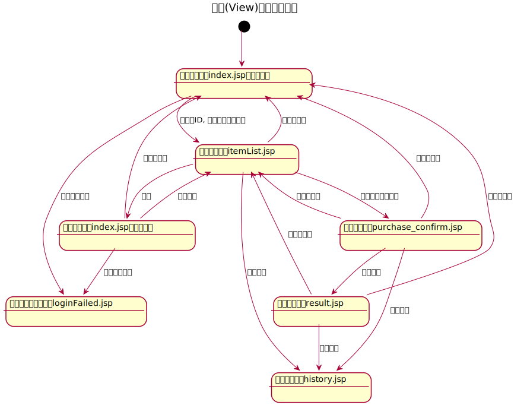

# Java MVCフレームワークでショッピング風サイトを作る

## View
|#|ファイル名|画面名|役割|
|:--|:--              |:---       |
|1|loin.jsp| ログイン画面|ショッピング風サイトのトップページ |
|2|loinNG.jsp| ログインエラー画面|ログイン処理失敗時のページ |
|3|itemList.jsp| 商品一覧画面|買い物対象商品の表示ページ |
|4|history.jsp| 購入履歴画面|ユーザの購入履歴照会ぺージ |
|5|purchase_confirm.jsp| 購入確認画面 |購入前の確認ページ|
|6|result.jsp|購入結果画面|購入結果の表示ページ |
|7|header.jsp| ヘッダー画面|共通ページ |

## 状態（画面）遷移図

## 参考URL
- [Java入門 -ショッピング風サイトの作成①- 井野 雄貴 先生 - 無料動画学習｜schoo（スクー）WEB-campus](https://schoo.jp/class/2945)
- [Java入門 -ショッピング風サイトの作成②- 井野 雄貴 先生 - 無料動画学習｜schoo（スクー）WEB-campus](https://schoo.jp/class/2946)
